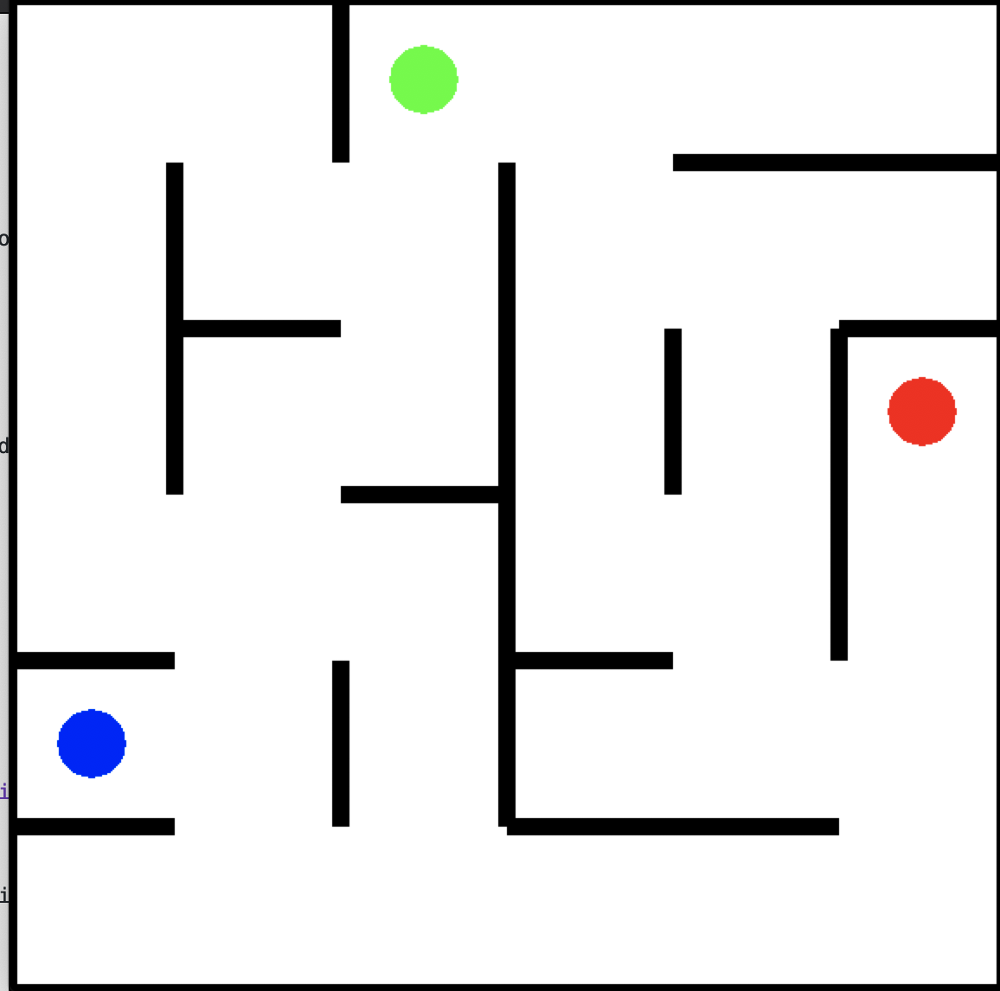

# pg637_labyrinth

In diesem Teil des Workshops geht es darum, ein kleines Reinforcement Learning Problem mit einer eigenen Implementierung zu lösen.
Das Hauptziel dabei ist es ins praktische Arbeiten zu kommen. Also sich mit den Feinheiten von RL-Algorithmen beschäftigen, die Tools (PyTorch) kennenzulernen und am eigenen Leib erfahren, wo die Tücken bei solchen Problemstellungen liegen.

Die Aufgabe ist sehr simpel gehalten. Das environment ist eine Art Labyrinth und der Agent muss von seiner Startposition zum Ausgang gelangen. Schafft er das, erhält er eine Belohnung von 1. Es gibt auch eine Falle im Labyrinth. Läuft der Agent auf das Feld mit der Falle erhält eine Belohnung von -1. In beiden Fällen endet der Spieldurchlauf.

In jedem Feld kann der Agent zwischen 4 Aktionen wählen: left, right, up, down. Jede dieser Aktionen bewegt ihn in die entsprechende Richtung. Wählt der Agent eine Aktion aus, mit der er gegen eine Wand läuft, verändert er seine Position in dieser Runde nicht.

## Bedienung des Environments

*Das Labyrinth besteht aus 36 Feldern mit den Indizes 0-35 von links nach rechts und oben nach unten durchgezählt.

*entry_id, exit_id und trap_id sind die Indizes des Eingangs, Ausgangs und der Falle.

*get_valid_directions(position_id) gibt eine Menge von Strings zurück, die die Richtungen angeben, in die man sich vom Feld mit dem Index position_id bewegen kann.

*move(direction, source_id) nimmt einen String 'right', 'left', 'up', 'down' und einen Feld Index und gibt ein Tupel (Feld Index, Belohnung) zurück, wobei der Feld Index das Feld indiziert, zu dem man mit der entsprechenden Aktion gelangt.

Der Ausgang ist für das Problem in diesem Fall 'günstig' gelegt. Falls ihr mit eurem Netz Erfolg habt, könnte es interessant sein, einmal zu schauen was passiert, wenn ihr Ausgang und Falle an andere Positionen im Labyrinth setzt.

## Tipps

Nutzt am besten erst mal ein möglichst einfaches neuronales Netz und vielleicht nutzt auch euer 'Expertenwissen' über das Labyrinth und gebt dem Netz perfekte Information, um im Zweifel eher Erfolge zu erzielen. Denkbar ist zum Beispiel eine Heuristik, die bestimmte Bewegungen zu bestimmten Feldern belohnt.

Macht euch DEBUG-AUSGABEN!!! Wie oft wird welches Feld besucht? Was empfiehlt die aktuelle Policy für welches Feld? Wie ist die Wertigkeit (Wenn ihr kein Value-Netzwerk habt, macht man das gewöhnlich über eine Monte-Carlo Simulation) eines Feldes? Schaut euch auch das README zu MNIST an.

In environment.py gibt es eine pretty_print Funktion, der ihr ein Liste mit 36 Werten (Wie oft wurde was besucht?) übergeben könnt. Die Funktion schreibt dann eine schön formattierte ASCII-Matrix in die Konsole, an der ihr die räumliche Verteilung der besuchten Zuständer/Felder ablesen könnt.

Falls euer Netz funktioniert lässt sich der Schwierigkeitsgrad auch erhöhen, indem ihr weniger Wissen über die Umgebung beim Agenten voraussetzt. Denkbar ist zum Beispiel eine Anwendung des REINFORCE Algorithmus. Das ist aber gar nicht so einfach, wie es zunächst aussieht und der Erfolg hängt sehr stark von euren Parametern und der Struktur des Labyrinths ab. Ihr solltet diese Lösung also auf keinen Fall auf Anhieb verfolgen.

